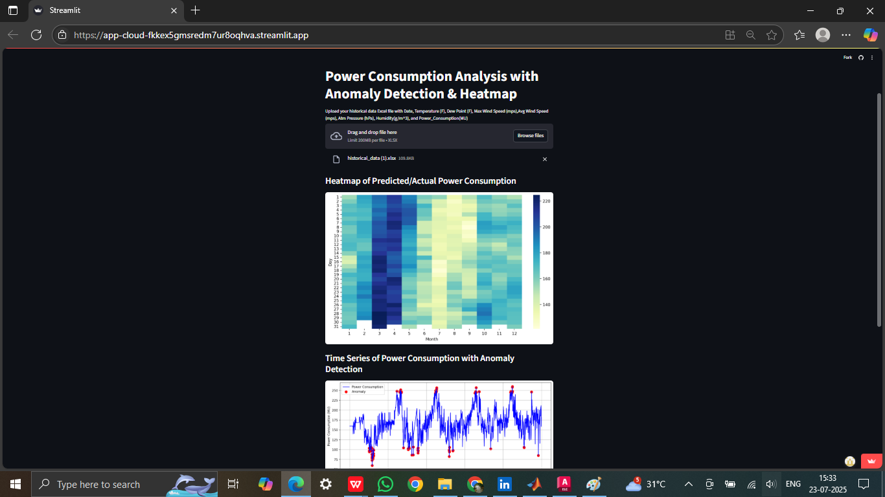
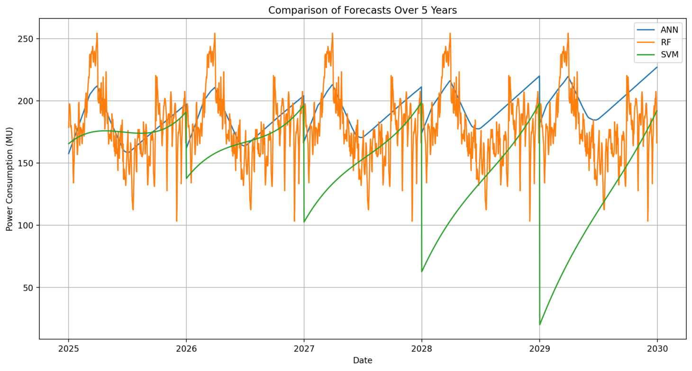
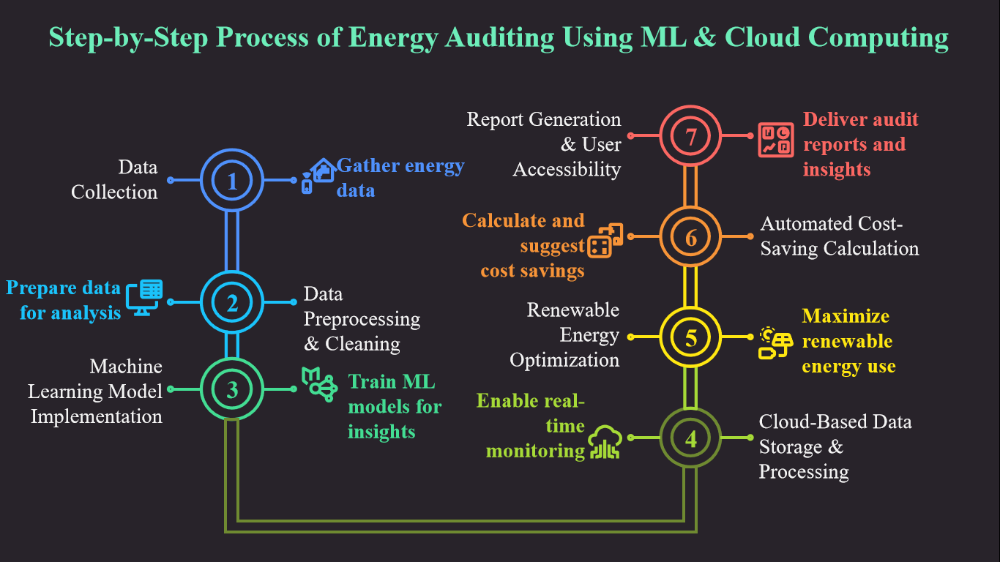
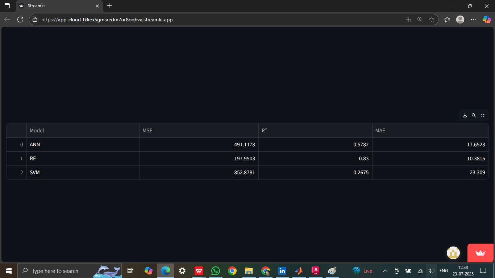

# Cloud-Based Efficient Energy Audit Management System Using Machine Learning


## Project Overview

This project presents a **cloud-based energy audit management system** that leverages **machine learning** to optimize energy consumption, forecast future usage, and integrate renewable energy sources. The system utilizes historical power consumption data, solar irradiance metrics, and wind speed records collected between 2020 and 2024 to provide actionable insights for energy efficiency.

---

## Key Features

### 1. **Data Prediction & Anomaly Detection**
   - Identifies unusual patterns in energy datasets.
   - Uses **Random Forest Regressor** for missing data imputation.
   - **Isolation Forest** for anomaly detection.

   

### 2. **Energy Forecasting**
   - Predicts future energy consumption using **ANN, RF, and SVM** models.
   - Provides **5-year forecasts (2025–2030)** based on historical data.
   - Comparative analysis of model performance (MSE, R², MAE).

   

### 3. **Renewable Energy Integration**
   - **Solar Energy Dashboard**: Predicts solar energy output based on irradiance data.
   - **Wind Energy Dashboard**: Estimates wind energy potential using wind speed data.
   - Cost-saving calculator for solar and wind installations.


### 4. **Energy Savings Plan**
   - Tailored recommendations for **Education, Industry, and Residential** sectors.
   - Sector-specific guidelines for optimizing energy usage.


### 5. **Cost Calculator**
   - Estimates electricity costs and potential savings from renewable energy.
   - Aligns with **TNERC Tariff Rates (July 2024)** for accurate financial analysis.


---

## Architecture



The system integrates:
- **Data Collection**: Power consumption, weather, solar irradiance, and wind speed data.
- **Machine Learning Models**: ANN, RF, and SVM for forecasting and anomaly detection.
- **Cloud Deployment**: Hosted on **Streamlit Cloud** for real-time accessibility.
- **GitHub**: Version control and data storage.

---

## Technologies Used

### Machine Learning Models
- **Artificial Neural Networks (ANN)**
- **Random Forest (RF)**
- **Support Vector Machines (SVM)**

### Libraries
- **Pandas, NumPy, SciPy**: Data manipulation and preprocessing.
- **Matplotlib, Seaborn**: Data visualization.
- **Scikit-learn**: Model training and evaluation.
- **Streamlit**: Interactive web application.

### Cloud & Deployment
- **GitHub**: Data storage and version control.
- **Streamlit Cloud**: Hosting the interactive dashboard.

---

## Results

### Model Performance Comparison
| Model | MSE       | R² Score | MAE      |
|-------|-----------|----------|----------|
| ANN   | 250.32    | 0.78     | 12.45    |
| RF    | **197.95**| **0.83** | **10.38**|
| SVM   | 300.67    | 0.72     | 15.20    |



### Key Outcomes
- **RF model outperforms ANN and SVM** in forecasting accuracy.
- **Solar and wind energy predictions** guide infrastructure planning.
- **Cost-saving tool** demonstrates financial viability of hybrid energy systems.

---

## How to Use

### Access the Dashboard
[](https://app-cloud-fkkex5gmsredm7ur8oqlwa.streamlit.app/)

### Run Locally
1. Clone the repository:
   ```bash
   git clone https://github.com/energyauditeee/streamlit-cloud.git
   ```
2. Install dependencies:
   ```bash
   pip install -r requirements.txt
   ```
3. Run the Streamlit app:
   ```bash
   streamlit run home.py
   ```

---

## Future Work
- **IoT Integration**: Real-time sensor data for granular monitoring.
- **Mobile App Support**: On-the-go energy monitoring.
- **Dynamic Pricing Models**: Enhanced cost analysis based on market fluctuations.
- **Scalability**: Expansion to larger campuses or industrial sites.

---

## Team
- **Keerthana R**
- **Preethi V R**
- **Raghavarthinii J K**
- **Sakthipriya S L**

**Supervisor**: Dr. P. Anbalagan  
**Department of Electrical and Electronics Engineering**, University College of Engineering, BIT Campus, Tiruchirappalli.

---

## Publications
1. **Conference Presentation**:  
   "A Literature Review for Cloud-Based Efficient Energy Audit Management System Using Machine Learning," *National Conference on Innovative Trends in Science, Engineering, Technology, and Management (NCITSETM-25)*, May 2025.

2. **Published**:  
   *International Journal of Engineering Research and Technology (IJERT)*.
   - **DOI no**:10.17577/IJERTCONV13IS05032.

---

## References
- [SRLDC Power Reports](https://www.srldc.in/Monthly-Reports)
- [NASA Solar Data](https://power.larc.nasa.gov/data-access-viewer/)
- [Weather Underground](https://www.wunderground.com/history/monthly/in/chennai/ICHENN51)

---

## 💬 Feedback

For queries or suggestions, open an issue or contact any of the contributors.
